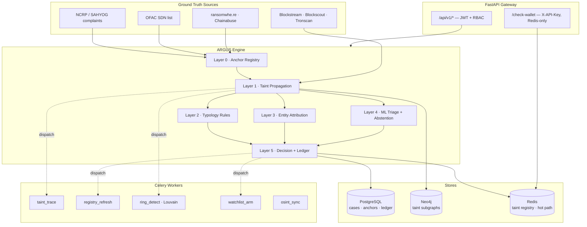

# ARGUS v2 — The Provenance Engine

### A judge-proof backend architecture for SIH26183 (MHA / I4C — Blockchain & Cybersecurity)

> **Thesis in one line:**
> Every other team will build a *classifier* that guesses which wallets are bad.
> We build a **provenance engine** that *proves* where a specific victim's money went — and only then uses ML to decide what to look at first.

---

## Table of contents

1. [The strategic reframe (read this first)](#1-the-strategic-reframe-read-this-first)
2. [Why the classifier-first approach loses](#2-why-the-classifier-first-approach-loses)
3. [The five-layer engine](#3-the-five-layer-engine)
4. [Layer 0 — Ground Truth Anchors](#layer-0--ground-truth-anchors)
5. [Layer 1 — The Taint Propagation Engine (core innovation)](#layer-1--the-taint-propagation-engine-core-innovation)
6. [Layer 2 — Typology Rule Engine](#layer-2--typology-rule-engine)
7. [Layer 3 — Entity Attribution (finding the VASP)](#layer-3--entity-attribution-finding-the-vasp)
8. [Layer 4 — ML Triage (deliberately demoted)](#layer-4--ml-triage-deliberately-demoted)
9. [Layer 5 — Decision Engine & Evidence Ledger](#layer-5--decision-engine--evidence-ledger)
10. [USP 1 — Cross-Victim Correlation, done properly](#usp-1--cross-victim-correlation-done-properly)
11. [USP 2 — Pre-Cashout Interception](#usp-2--pre-cashout-interception)
12. [USP 3 — Provenance Replay (the money-trail animation)](#usp-3--provenance-replay-the-money-trail-animation)
13. [Tech stack](#13-tech-stack)
14. [System architecture](#14-system-architecture)
15. [Data model](#15-data-model)
16. [API surface](#16-api-surface)
17. [Repository structure](#17-repository-structure)
18. [How we prove accuracy (evaluation protocol)](#18-how-we-prove-accuracy-evaluation-protocol)
19. [Implementation roadmap](#19-implementation-roadmap)
20. [Judge Q&A armoury](#20-judge-qa-armoury)
21. [What we deliberately do NOT claim](#21-what-we-deliberately-do-not-claim)

---

## 1. The strategic reframe (read this first)

The problem statement says:

> *"Investigators currently cannot quickly determine **which exchange/VASP** a wallet ultimately funnels into, which delays freezing assets."*

Read that carefully. The ask is **not** "build a fraud classifier." The ask is **attribution and speed**: *follow this specific victim's money, tell me where it landed, fast enough to freeze it.*

That distinction is the entire architecture.

| | Classifier-first (what most teams build) | **Provenance-first (ARGUS v2)** |
|---|---|---|
| Unit of analysis | A wallet | **A fund flow** |
| Question answered | "Is this wallet bad?" | **"Where did *this victim's* ₹8.4L go, and how much is still recoverable?"** |
| Ground truth needed | A globally labeled dataset of bad wallets | **One FIR/NCRP complaint** — legally attested, already exists |
| Output | A probability | **A chain of custody: tx hashes, amounts, timestamps, destination** |
| Failure mode | False accusation of an innocent wallet | Worst case: we trace fewer hops than ideal |
| Judge's hardest question | "Your model is 47% precise — will you freeze innocent people's money?" | *(not applicable — see §20)* |

**The anchor is the complaint, not the model.** A victim filing an FIR is a legal attestation that funds left their control fraudulently. That is our ground truth — and it is *stronger* ground truth than any public dataset, because it is sworn, dated, and jurisdiction-backed.

From that anchor, everything downstream is **deterministic arithmetic over public blockchain data**. Value conservation is a mathematical property of a blockchain. We are not predicting. We are *accounting*.

> **The sentence that wins the room:**
> *"We don't accuse wallets. We follow money. Our freeze recommendation is a receipt, not a prediction — here are the 14 transaction hashes that connect this victim's complaint to this exchange deposit address, and here is the exact rupee amount that is still sitting there."*

---

## 2. Why the classifier-first approach loses

We have empirical evidence from our own v1 build. These are documented, reproducible findings — and they are the strongest argument *for* the v2 design:

| Finding (from v1, documented in `docs/ml.md`, `docs/incidents/`) | Implication |
|---|---|
| **0% live graph coverage.** We sampled 40 fresh BTC + 40 fresh ETH addresses from recent blocks. **Zero** appeared in the 822,942-node Elliptic++ graph. | A model trained on a 2017–18 Bitcoin snapshot has *no node* for a wallet a scammer created last Tuesday. Graph/embedding features are structurally dead for real victim-reported addresses. |
| **Temporal drift breaks absolute features.** Training block heights: 391K–448K. Live: 900K+. XGBoost cannot extrapolate — every modern address routes to the same leaves. | Satoshi's genesis address scored **0.791 HIGH**. The Ethereum Foundation scored **0.806 HIGH**. Both are indisputably legitimate. |
| **A self-referential label leak produced a fake AUC-PR of 1.0.** Graph features seeded `illicit` labels from the *full* dataset, so every test illicit wallet found itself at `shortest_path = 0`. 4,938/4,938 test illicit wallets self-flagged. | Corrected AUC-PR: **0.4574** vs. baseline **0.4665**. Graph features added *literally zero* real signal. We caught it ourselves and reverted. |
| **Honest production number: BTC test AUC-PR 0.4665, recall 0.391 at 1.59% FPR.** | At any operating point, we miss ~60% of illicit wallets and flag ~1.6% of innocent ones. **You cannot freeze bank accounts on that.** |

A 1.6% false-positive rate sounds small until you apply it to a real exchange. Binance processes millions of deposits. 1.6% of that is tens of thousands of innocent Indian users having their funds frozen — per day. **That system would be shut down within a week, and a judge who knows finance will ask exactly this.**

So: we keep the ML. We just stop letting it make accusations.

---

## 3. The five-layer engine

```
                   ┌──────────────────────────────────────────────┐
   VICTIM FIR ────► │  LAYER 0 · GROUND TRUTH ANCHORS              │
   OFAC SDN    ────►│  Attested facts only. Every anchor carries    │
   OSINT feeds ────►│  source + date + attestation class.           │
                   └──────────────────┬───────────────────────────┘
                                      │ anchor set A
                   ┌──────────────────▼───────────────────────────┐
                   │  LAYER 1 · TAINT PROPAGATION ENGINE           │
                   │  Haircut / Poison / FIFO apportionment over    │
                   │  live explorer data. Deterministic. Auditable. │
                   │  OUTPUT: tainted_value(address) + proof path   │
                   └──────────────────┬───────────────────────────┘
                                      │ tainted subgraph G*
         ┌────────────────────────────┼────────────────────────────┐
         │                            │                            │
┌────────▼─────────┐     ┌────────────▼───────────┐   ┌────────────▼──────────┐
│ LAYER 2          │     │ LAYER 3                │   │ LAYER 4               │
│ TYPOLOGY RULES   │     │ ENTITY ATTRIBUTION     │   │ ML TRIAGE             │
│ peel chain,      │     │ deposit-address        │   │ XGBoost + SHAP        │
│ fan-out, mixer,  │     │ clustering → VASP      │   │ WITH ABSTENTION       │
│ bridge, velocity │     │ sweep-pattern proof    │   │ ranks queue only      │
└────────┬─────────┘     └────────────┬───────────┘   └────────────┬──────────┘
         └────────────────────────────┼────────────────────────────┘
                   ┌──────────────────▼───────────────────────────┐
                   │  LAYER 5 · DECISION ENGINE + EVIDENCE LEDGER  │
                   │  monitor / hold_for_review / block            │
                   │  ── BLOCK requires an L0 anchor + L1 proof ── │
                   │  SHA-256 hash-chained, Merkle-rooted per case │
                   └──────────────────────────────────────────────┘
```

**The load-bearing constraint, stated once and enforced in code:**

> A `block` decision **cannot** be produced by Layer 4. It requires a Layer-0 anchor connected by a Layer-1 taint path. ML can raise a `hold_for_review`. It can never freeze money.

This is not a policy document line — it is a `raise` statement in `decision_engine.py` with a unit test. See §20, Q1.

---

## Layer 0 — Ground Truth Anchors

Nothing enters the system as "bad" without provenance. An anchor is a typed record:

```python
@dataclass(frozen=True)
class Anchor:
    address: str
    chain: Chain
    attestation: AttestationClass   # LEGAL_COMPLAINT | SOVEREIGN_DESIGNATION
                                    # | PUBLIC_ATTRIBUTED_REPORT | INVESTIGATOR_ASSERTED
    source_ref: str                 # "NCRP-2026-04412" | "OFAC SDN 2026-09-04" | "ransomwhe.re"
    asserted_at: datetime
    asserted_by: str                # complainant UUID | "US Treasury OFAC" | "ransomwhe.re"
    victim_amount_inr: Decimal | None
    evidence_uri: str | None        # scan of FIR, SDN list URL, report permalink
    confidence_class: Literal["A", "B", "C"]
```

| Class | Attestation | Sources | Can justify a `block`? |
|---|---|---|---|
| **A** | Legally attested / sovereign | NCRP complaint, FIR, OFAC SDN, MHA designation | **Yes** |
| **B** | Publicly attributed report | ransomwhe.re (ransomware family), Chainabuse, BitcoinAbuse | Only with ≥2 independent B sources, or 1 B + strong taint |
| **C** | Investigator hypothesis | Analyst marked during a case | No — `hold_for_review` ceiling |

**Why this matters to a judge:** every red pixel on our dashboard can be clicked back to a scanned FIR or a treasury.gov URL. There is no "the model said so."

**Anti-feedback-loop rule (we found this bug in v1):** an address flagged *by our own system* never becomes an anchor. Anchors are externally attested only. Otherwise the model eventually trains on its own output — a documented open risk in v1 that we close by construction here.

---

## Layer 1 — The Taint Propagation Engine (core innovation)

This is the heart of ARGUS v2 and the part no other team will have.

### 1.1 The idea

Forensic accounting has a solved problem here, and FATF/Chainalysis-class tooling uses it: **taint apportionment**. When tainted funds mix with clean funds in a wallet, you apportion the taint onward by a defined rule.

We implement three rules and let the investigator choose (defaults to haircut):

| Method | Rule | Use |
|---|---|---|
| **Haircut** *(default)* | Taint propagates **pro-rata by value**. If a wallet is 30% tainted and sends 1 BTC, that output carries 0.3 BTC of taint. | Conservative, courtroom-friendly, the standard. |
| **Poison** | Any contact with taint makes the **entire** balance tainted. | Upper bound / worst case view. Used for mixer boundaries. |
| **FIFO** | First satoshi in = first satoshi out. Deterministic ordering on UTXO chains. | BTC, where input/output ordering is explicit and legally cleaner. |

### 1.2 The algorithm

```python
def propagate_taint(
    anchors: list[Anchor],
    max_hops: int = 8,
    min_taint_fraction: float = 0.005,   # 0.5% — the dilution floor
    max_nodes: int = 5_000,
    method: TaintMethod = TaintMethod.HAIRCUT,
) -> TaintedSubgraph:
    """
    Priority-first BFS outward from anchor addresses.
    Frontier is ordered by ABSOLUTE tainted value, not hop count —
    we chase the money, not the topology.
    """
    frontier = PriorityQueue()          # max-heap on tainted_value
    for a in anchors:
        frontier.push(TaintNode(a.address, taint_value=a.victim_amount,
                                taint_fraction=1.0, hop=0, path=[a.source_ref]))

    visited: dict[Address, TaintNode] = {}

    while frontier and len(visited) < max_nodes:
        node = frontier.pop()
        if node.hop >= max_hops:                   continue
        if node.taint_fraction < min_taint_fraction: continue   # dilution floor

        # Terminal conditions — stop and record WHY
        if entity := attribute_entity(node.address):           # Layer 3
            record_terminal(node, TerminalKind.VASP, entity)
            continue                                            # exchanges are sinks
        if is_known_mixer(node.address):
            record_terminal(node, TerminalKind.MIXER_BOUNDARY)
            continue                # obfuscation point — we STOP and say so
        if is_bridge_contract(node.address):
            enqueue_cross_chain_correlation(node)               # §2.4
            continue

        outgoing = explorer.get_outgoing_transfers(node.address, after=node.first_tainted_at)
        total_out = sum(t.amount for t in outgoing)

        for tx in outgoing:
            child_taint = apportion(method, node, tx, total_out)
            if child_taint.value <= DUST[chain]:   continue
            frontier.push(child_taint.with_path(node.path + [tx.hash]))

    return TaintedSubgraph(visited, terminals, proof_log)
```

### 1.3 Why every design choice here is defensible

| Choice | Justification if challenged |
|---|---|
| **Value-ordered frontier, not hop-ordered** | Chasing ₹8L through 6 hops matters more than ₹200 through 2. Bounded compute goes where the money is. This is also why we hit the 5-minute SLA. |
| **Dilution floor at 0.5%** | Prevents flagging a wallet holding 0.003% taint — the *entire* false-positive class of naive taint tracking. Configurable; every report states the floor used. |
| **Mixers are a hard stop** | We record `"trail terminates at mixer boundary — confidence degraded, downstream attribution NOT claimed"`. Overclaiming past a mixer is the single most common way forensic tools get discredited in court. We refuse to do it. |
| **Exchanges are sinks** | Once funds hit a VASP deposit address, on-chain tracing ends and *legal process* begins. That's the handoff, and it's the actual deliverable. |
| **Explicit `max_hops`, `max_nodes`** | Bounded, terminating, reproducible. Same inputs → same output, always. We can re-run any historical case and get a byte-identical trail. |

### 1.4 What this produces

```json
{
  "anchor": { "ncrp_ref": "NCRP-2026-04412", "victim_loss_inr": 840000,
              "address": "bc1q...", "attestation": "LEGAL_COMPLAINT" },
  "terminals": [
    {
      "address": "1MdYC...",
      "entity": { "name": "Binance", "type": "VASP", "confidence": 0.94,
                  "basis": "deposit-address sweep cluster, 41 observations" },
      "tainted_value_btc": 0.0612,
      "tainted_value_inr": 512400,
      "taint_fraction": 0.726,
      "hops": 5,
      "elapsed_from_victim": "00:41:22",
      "proof_path": ["a3f9...", "77bc...", "0e21...", "9f44...", "c108..."],
      "still_on_chain": true,
      "recoverable_estimate_inr": 512400
    }
  ],
  "unattributed_residual_inr": 190000,
  "terminated_at_mixer_inr": 137600,
  "method": "haircut", "dilution_floor": 0.005, "max_hops": 8,
  "reproducible_hash": "sha256:4b91c2..."
}
```

**Read that JSON as a judge would.** There is no probability anywhere in the block that justifies the freeze. There is an amount, a route, and a list of transaction hashes anyone can verify on a public block explorer in thirty seconds.

### 1.5 Cross-chain bridge correlation

Bridges are where most teams' traces die. We handle them with a **deterministic matching heuristic**, and we state its confidence honestly:

```
Given: tainted deposit into known bridge contract B on chain X
       at time T, amount V.
Search: chain Y outputs from B's counterpart contract in window [T, T+Δ]
        with amount ∈ [V·(1-fee_max), V·(1-fee_min)]
Score:  amount_match(0.5) + time_proximity(0.3) + recipient_novelty(0.2)
Emit:   CrossChainLink(confidence, "HEURISTIC — not cryptographic proof")
```

We **never** present a bridge hop as certain. It is labeled `probable_bridge_link` with its score, and the UI renders it as a dashed edge. That single honest choice is worth more with a technical judge than ten confident-but-wrong hops.

---

## Layer 2 — Typology Rule Engine

Deterministic pattern detectors over the tainted subgraph. Zero ML. 100% explainable. Each emits a named match, the exact transactions that triggered it, and a plain-English sentence for the report.

| Detector | Trigger condition | Emitted narrative |
|---|---|---|
| `PEEL_CHAIN` | ≥4 sequential hops, per-hop value retention 0.85–0.99, small residual split off each hop | *"Peel chain: 7 hops, 93.4% retained per hop, ₹41K peeled off at each step across 6 wallets."* |
| `FAN_OUT` | 1 → ≥5 recipients within window T (default 15 min) | *"Layering: split into 11 wallets within 4m12s of receipt."* |
| `FAN_IN` | ≥5 sources → 1 within T | *"Consolidation hub: aggregated from 14 addresses in 22 minutes."* |
| `RAPID_HOP` | median inter-hop gap < 5 min across ≥3 hops | *"Automated movement: median dwell time 47 seconds — consistent with scripted laundering."* |
| `STRUCTURING` | ≥4 transfers within 10% of a common value, below a reporting threshold | *"Structuring: 9 transfers of ₹1.9–2.0L, each below the ₹2L reporting line."* |
| `DORMANT_BURST` | wallet age > 90d, zero activity, then ≥5 tx in 1h | *"Dormant burner activated: first activity in 147 days, then 8 transactions in 34 minutes."* |
| `MIXER_CONTACT` | counterparty ∈ mixer registry | *"Obfuscation: funds entered Tornado Cash. Downstream attribution not claimed."* |
| `BRIDGE_HOP` | counterparty ∈ bridge registry | *"Cross-chain: ETH → TRON via Poly Bridge, probable link (0.81)."* |
| `ROUND_TRIP` | taint returns to a node within the anchor's own cluster | *"Circular flow: funds returned to the originating cluster after 6 hops — wash activity."* |
| `EXCHANGE_SPRAY` | taint splits across ≥3 distinct VASPs | *"Cash-out spray: simultaneous deposits to 4 exchanges — coordinated extraction."* |

### Why this beats a model

These detectors have a property no classifier has: **their precision is exactly measurable and their logic is inspectable.** We generate synthetic laundering patterns with known ground truth (§18), run the detectors, and report per-detector precision/recall. A judge can read the rule, read the matched transactions, and verify the call themselves. There is nothing to dispute.

Rules live in a declarative registry so adding a typology is a ~20-line file, not a retrain:

```python
@register_typology("PEEL_CHAIN", severity=Severity.HIGH)
def detect_peel_chain(sg: TaintedSubgraph, cfg: PeelConfig) -> list[TypologyMatch]:
    ...
```

---

## Layer 3 — Entity Attribution (finding the VASP)

This is the literal deliverable of the problem statement, so it gets first-class engineering.

### 3.1 Four independent attribution methods, fused

| # | Method | How | Confidence |
|---|---|---|---|
| 1 | **Known-entity registry** | Curated public labels (exchange hot/cold wallets, from Blockscout metadata tags, public label clouds, OFAC). Provenance-tracked per entry. | 0.95–1.0 |
| 2 | **Deposit-address sweep clustering** ⭐ | Exchanges give each user a unique deposit address, then *sweep* balances to a hot wallet. Detect: address receives from many sources, sends ~100% to a single known hot wallet, repeatedly. → the deposit address belongs to that exchange. | 0.80–0.95 |
| 3 | **Common-input-ownership (BTC)** | Two addresses appearing as inputs to the same transaction are almost certainly controlled by one entity. Classic, high-precision UTXO heuristic. | 0.90+ |
| 4 | **Behavioural fingerprint** | Sweep interval regularity, gas-price policy, batch sizes, nonce cadence. Matches an unlabeled address to a known exchange's operational signature. | 0.60–0.80 |

**Method 2 is the one that impresses.** It solves the actual hard problem: victim funds don't land on `34xp4v...` (Binance's famous cold wallet, which everyone can label). They land on a fresh, unlabeled, per-user deposit address. Sweep clustering attributes that fresh address correctly, and the *proof* is the sweep history:

```
Address 1MdYC... is attributed to Binance (confidence 0.94) because:
  • It received from 63 distinct sources over 118 days
  • It forwarded 99.7% of every balance to 34xp4v... within 4–19 minutes
  • 34xp4v... is a publicly labeled Binance cold wallet (Blockscout tag, OFAC-clean)
  • 41 such sweeps observed; zero outgoing transfers to any other destination
```

Every attribution ships with `basis` text like the above. Never a bare label.

### 3.2 Output contract

```python
class EntityAttribution(BaseModel):
    entity_name: str            # "Binance"
    entity_type: Literal["VASP", "MIXER", "BRIDGE", "MERCHANT", "UNKNOWN"]
    jurisdiction: str | None    # drives which legal process applies
    confidence: float
    methods: list[AttributionMethod]   # which of the 4 fired
    basis: str                  # human-readable proof, always populated
    kyc_reachable: bool         # can Indian LEA actually serve this entity?
```

`kyc_reachable` is a small field with big demo value: it turns "we found Binance" into **"we found Binance, which has an Indian FIU-IND registration, so a freeze request under the PMLA is actionable today."** That is the sentence that connects technology to outcome.

---

## Layer 4 — ML Triage (deliberately demoted)

We keep XGBoost + SHAP. We change its job title.

**Old job:** decide if a wallet is criminal.
**New job:** decide which of the 4,000 open items an investigator opens first.

### Three changes that make it defensible

**1. Abstention is a first-class output.**

```python
class TriageScore(BaseModel):
    score: float | None
    coverage: float                 # fraction of features actually computable
    verdict: Literal["ranked", "insufficient_evidence"]
    evidence: list[ShapContribution]
```

If feature coverage < 0.6, or the address is out of the training distribution (block-height OOD check — the exact bug that made Satoshi's address score 0.79 in v1), we return `insufficient_evidence` rather than a number. **A system that knows what it doesn't know is a system a judge trusts.**

**2. Relative, stationary features only.**
No absolute block heights. Everything is normalized against a rolling era reference: `wallet_age_relative`, `fee_percentile_in_era`, `velocity_z_score`. This directly fixes the documented v1 OOD failure.

**3. Ranking metrics, not accusation metrics.**
We report **Precision@k** and **NDCG@20** — "of the top 20 items we surfaced to the investigator, how many were genuinely worth their time?" That is the metric that matches the job. Reporting AUC-PR for a triage queue is answering a question nobody asked.

We also keep publishing AUC-PR honestly (BTC 0.4665) **and explain why it doesn't matter anymore** — because the score never triggers an enforcement action. See §20, Q2.

---

## Layer 5 — Decision Engine & Evidence Ledger

### 5.1 Three-tier action, with a structural guarantee

| Action | Meaning | Required evidence | Reversible |
|---|---|---|---|
| `monitor` | Log and watch. No user impact. | Anything | n/a |
| `hold_for_review` | **Soft hold**, SLA-bound (default 4h), routed to a named investigator, auto-releases on expiry. | ML triage, or class-B/C anchors, or typology matches | Yes, automatically |
| `block` | Hard freeze recommendation to the VASP. | **Class-A anchor + Layer-1 taint path + ≥1 attributed terminal** | Yes, with audit trail |

```python
def decide(ctx: DecisionContext) -> Decision:
    if ctx.has_class_a_anchor and ctx.taint_proof and ctx.taint_fraction >= BLOCK_MIN_TAINT:
        return Decision.block(justification=render_freeze_dossier(ctx))

    if ctx.ml_triage.score and ctx.ml_triage.score >= HOLD_THRESHOLD:
        return Decision.hold_for_review(expires_in=timedelta(hours=4), ...)
    ...

    # Structural guarantee — enforced, not documented
    assert not (decision.action == "block" and decision.basis_is_ml_only), \
        "ML alone can never produce a block. See ARGUS-ENGINE-V2.md §3."
```

That assertion has a unit test named `test_ml_alone_can_never_block`. When a judge asks the false-positive question, we don't argue — **we show them the test.**

### 5.2 Auto-release + appeal

Every `hold_for_review` carries an expiry and an appeal hook. If no investigator acts within the SLA, funds release automatically and the miss is logged as a metric. A system that fails *open* for innocent users and *logged* for oversight is a system that can actually deploy in a democracy.

### 5.3 Tamper-evident evidence ledger

Every material event — anchor ingested, trail computed, typology matched, attribution made, decision issued, case viewed, PDF exported — appends to a hash chain:

```
entry_hash = SHA256( prev_hash || canonical_json(event) || timestamp_utc )
```

Per case, we compute a **Merkle root** over its entries and print it on the PDF report. Anyone holding the report can later verify no event was altered or removed.

**Honest scoping, stated on the report itself:**
> *"This Merkle root provides cryptographic integrity evidence for the investigation record. It is not, by itself, a Section 65B(4) certificate — that requires a signed statement from the person responsible for the computer system. ARGUS produces the artifact; the authorised officer signs it."*

Being precise here is worth more than claiming "65B compliant" and getting cross-examined on it. (v1 made exactly this overclaim and we removed it — see `docs/progress.md`, audit item 2.)

---

## USP 1 — Cross-Victim Correlation, done properly

The v1 version matched addresses across complaints. That's correct but shallow. The v2 version correlates at **four levels**, and the extra three come almost free once Layer 1 exists.

| Level | Match on | Why it matters | Precision |
|---|---|---|---|
| **L1 · Direct** | Same address reported by ≥2 complaints | Baseline. Deterministic. | ~100% |
| **L2 · Cluster** | Different addresses, **same entity cluster** (common-input-ownership / sweep cluster) | Scammers use a fresh address per victim. L1 misses them entirely. **L2 catches them.** | ~95% |
| **L3 · Confluence** ⭐ | Different addresses whose **taint trails converge** at a shared downstream node | Two victims, two burner wallets, funds merge at hop 4 → same operation. *This is only visible because we built Layer 1.* | ~90% |
| **L4 · Behavioural** | Same typology signature + temporal proximity + same cash-out VASP | Weakest link, flagged as a hypothesis for analyst confirmation only. | ~70%, class-C |

### The fraud-ring view

Run **Louvain community detection** over the union of all victims' taint subgraphs. Communities = fraud rings. Output per ring:

```
RING-2026-017  ·  confidence HIGH
  14 victims  ·  6 states (MH, KA, TN, DL, UP, GJ)  ·  ₹92,40,000 total loss
  31 wallets  ·  2 chains  ·  dominant typology: PEEL_CHAIN + EXCHANGE_SPRAY
  cash-out: Binance (₹41L), Huobi (₹18L), unattributed (₹33L)
  first seen 2026-07-14  ·  still active (last tx 6h ago)  ·  ⚠ ACTIVE
```

**Why this is the highest-value screen in the product:** it converts 14 separate district-level complaints — which would otherwise be investigated by 14 different officers who never speak — into **one case, one ring, one freeze request.** That is a genuine operational transformation for I4C, and it requires no ML at all.

L3 confluence is the demo moment. *"These two victims are in different states and never met. Their money met, at hop four, in this wallet, eleven minutes apart."*

---

## USP 2 — Pre-Cashout Interception

The v1 chokepoint answered: *"is this incoming deposit from a known-bad address?"* — reactive, and only works if we already knew.

v2 flips it: **we arm the trap before the money arrives.**

### 2.1 The predictive watchlist

When Layer 1 traces a live trail, it doesn't just report where funds *went* — it projects where they are *going*:

```
For each active (non-terminal) tainted node:
  predict next-hop destinations from
    · the cluster's historical cash-out venues
    · the typology in progress (a peel chain has a predictable tail)
    · observed inter-hop cadence
  → PRE-REGISTER those candidate addresses in Redis with the case reference
  → TTL = 3 × median observed hop interval
```

Now when the deposit actually lands at the exchange, `/check-wallet` returns a hit **on the first query** — because we got there first. The freeze happens at the cash-out attempt, not three days later in a spreadsheet.

### 2.2 Time-to-cashout estimator

From observed hop cadence, project arrival at a VASP:

```
ETA_cashout = Σ (remaining_hops × median_hop_interval) ± IQR
```

Rendered in the UI as a live countdown per case. `⏱ ₹5.12L projected to reach Binance in ~00:11:40`.

This single number changes the product's posture from *forensic* (what happened) to **operational** (what is about to happen, and how long you have). It is also the most demo-able thing in the entire build.

### 2.3 The hot path stays honest

```
VASP → POST /check-wallet
     → Redis GET taint:{chain}:{address}         ← single O(1) lookup, nothing else
     → decision from precomputed materialized view
     → if hold/block: async Celery fan-out (alert, case link, ledger append)
     → respond
Target: p95 < 200ms   ·   v1 measured p95 = 71ms with the same design
```

No Postgres, no Neo4j, no explorer call in the hot path. The registry is a **materialized view** refreshed asynchronously by the taint engine — never computed on demand. (This design survives from v1 unchanged because it was already right, and we have the load-test numbers: 500 requests @ c=25 → p95 71.25ms, 617 req/s.)

### 2.4 The freeze dossier

A `block` doesn't emit a score. It emits a document the compliance officer can act on:

```
FREEZE RECOMMENDATION · Case ARGUS-2026-0441 · Ledger root 4b91c2...

Address:          1MdYC...  (Binance deposit address, attribution confidence 0.94)
Tainted amount:   0.0612 BTC  ≈  ₹5,12,400
Taint fraction:   72.6% of the balance received
Anchor:           NCRP-2026-04412, filed 2026-09-09 14:22 IST, Pune City Cyber PS
                  Victim loss ₹8,40,000 · attestation: LEGAL_COMPLAINT
Route:            5 hops, 41m22s from victim wallet to this deposit address
Proof:            a3f9... → 77bc... → 0e21... → 9f44... → c108...
                  (verify any hash at blockstream.info)
Typologies:       PEEL_CHAIN (7 hops, 93.4% retention), RAPID_HOP (median 47s)
Corroboration:    2 additional NCRP complaints converge on hop 3 (RING-2026-017)
Legal basis:      Binance is FIU-IND registered · PMLA freeze request actionable
Requested action: HOLD pending LEA communication · auto-release 2026-09-11 18:22 IST
```

Hand that to a compliance officer and they can act. Hand them `risk_score: 0.87` and they cannot.

---

## USP 3 — Provenance Replay (the money-trail animation)

Not a force-directed graph that wiggles. A **forensic replay of real time**, with four ideas no one else will have.

### 3.1 Real time, not frame time

The scrubber is bound to **actual block timestamps**. Dragging it to `14:31:08 IST` shows exactly the on-chain state at 14:31:08. Speed control is `1× / 60× / 3600×` of *real elapsed time*. An investigator watching a 40-minute laundering run at 60× sees it unfold in 40 seconds — with the real clock visible.

### 3.2 The money is the visual

| Visual channel | Encodes |
|---|---|
| Edge **thickness** | absolute tainted value (₹) |
| Edge **saturation** | taint fraction (0–100%) |
| Node **ring** | share of balance that is tainted |
| Node **shape** | wallet / exchange / mixer / bridge |
| Edge **style** | solid = on-chain proof · **dashed = probable bridge link** |

You watch ₹8.4L enter as one thick, fully saturated edge and progressively **split and fade** across the screen. The dilution of the victim's money is the animation. Nobody needs the legend explained.

### 3.3 Typologies annotate themselves on the trail

As the replay passes hop 3, a label attaches to the visible segment: **`⚡ FAN-OUT — split into 11 wallets in 4m12s`**. At hop 7: **`🔗 PEEL CHAIN — 93.4% retained per hop`**. At the mixer: **`🌀 TRAIL ENDS — Tornado Cash. Downstream not claimed.`**

The animation is not decoration — it is the evidence narrative rendering itself in chronological order. Everything on screen is a Layer-2 match with the matched tx hashes one click away.

### 3.4 The counterfactual recovery slider ⭐

**This is the feature that wins the pitch.**

A second scrubber labeled *"If funds had been frozen at…"*. Drag it, and the UI recomputes how much of the victim's money would still have been recoverable at that moment — because we have the full taint-over-time state, this is exact arithmetic, not a simulation:

```
Frozen at T+00:05  →  ₹8,40,000 recoverable  (100%)
Frozen at T+00:14  →  ₹7,21,000 recoverable  ( 86%)
Frozen at T+00:41  →  ₹5,12,400 recoverable  ( 61%)  ← ARGUS detected here
Frozen at T+04:00  →  ₹1,08,000 recoverable  ( 13%)
Frozen at T+72:00  →  ₹      0 recoverable  (  0%)  ← current NCRP reality
```

Then the closing line writes itself:

> *"Today, this complaint would be actioned in about three days, and ₹0 would come back. ARGUS flagged it in 41 minutes with ₹5.12 lakh still on-chain and an FIU-registered exchange to serve. That difference is the entire project."*

That chart quantifies the ROI of the system in one image, using the victim's own real numbers. No other feature on any team's dashboard will do that.

### 3.5 Live mode

For an active case, subscribe to the frontier addresses (explorer polling / mempool where available). New transactions animate in as they confirm, the ETA countdown updates, and the ring view re-clusters. The demo can be *running live on a real chain* while we present.

---

## 13. Tech stack

| Layer | Choice | Why this one |
|---|---|---|
| **API** | FastAPI (Python 3.11) | Async-native (explorer I/O is the bottleneck), auto OpenAPI, Pydantic v2 validation at the boundary. |
| **Async jobs** | Celery + Redis broker | Taint propagation is seconds-to-minutes; it must be off the request path. Redis already present — no new infra. |
| **Graph store** | Neo4j 5 | Native variable-length path queries. The taint subgraph *is* a graph; storing it in Postgres means writing recursive CTEs we'd regret. |
| **Relational** | PostgreSQL 15 | Cases, complaints, anchors, ledger, audit. ACID matters for the evidence ledger. |
| **Hot registry** | Redis 7 | O(1) taint lookup for `/check-wallet`. Materialized view, TTL-managed, never computed on demand. |
| **ML** | XGBoost + SHAP | Triage only. Tree models because SHAP on trees is exact, not approximate — explainability is a requirement, not a nice-to-have. |
| **Community detection** | `python-louvain` / `networkx` | Fraud-ring clustering. Deterministic with a fixed seed. |
| **NER** | Ollama + Llama-3.2-3B, spaCy fallback | Air-gapped FIR parsing. 3B fits in 4GB VRAM; verified ~2.8s warm. Sovereignty requirement, not a feature. |
| **Explorers** | Blockstream Esplora (BTC), Blockscout v2 (ETH), Tronscan (TRON) | **All keyless or free-tier**, all live mainnet. No paid Chainalysis dependency — that *is* the sovereignty USP. |
| **Reports** | ReportLab + Merkle root | Court-ready PDF with integrity hash. |
| **Contract** | OpenAPI 3.1, hand-written first | Frontend generates types from it; drift becomes a compile error, not a demo-day surprise. |
| **Deploy** | Docker Compose | One command on demo day. Non-negotiable. |

**Deliberately not used:** any commercial blockchain-analytics API (defeats sovereignty), any GNN in the serving path (v1 proved 0% live graph coverage makes embeddings dead weight), any LLM in the decision path (unauditable — LLM touches complaint *text* only, never the verdict).

---

## 14. System architecture



### The two request paths, kept strictly apart

```
COLD PATH (investigation, seconds–minutes)
  POST /api/v1/trace
    → Celery: taint_trace
    → explorer fan-out (async, rate-limited, cached)
    → Layers 1→2→3→4→5
    → persist subgraph to Neo4j, decision to Postgres, ledger append
    → materialize taint:{chain}:{addr} into Redis
    → SSE/poll progress to the UI

HOT PATH (chokepoint, <200ms p95)
  POST /check-wallet
    → Redis GET taint:{chain}:{addr}      ← the ONLY blocking call
    → map to allow / hold / block
    → Celery fan-out for alert + ledger (off the response path)
    → respond
```

---

## 15. Data model

### PostgreSQL (the parts that are new vs. v1)

```sql
-- Layer 0: nothing is "bad" without one of these
CREATE TABLE anchors (
    id                UUID PRIMARY KEY DEFAULT gen_random_uuid(),
    address           TEXT NOT NULL,
    chain             TEXT NOT NULL,
    attestation_class CHAR(1) NOT NULL CHECK (attestation_class IN ('A','B','C')),
    attestation_type  TEXT NOT NULL,   -- LEGAL_COMPLAINT | SOVEREIGN_DESIGNATION | ...
    source_ref        TEXT NOT NULL,   -- NCRP-2026-04412 | OFAC SDN 2026-09-04
    asserted_by       TEXT NOT NULL,
    asserted_at       TIMESTAMPTZ NOT NULL,
    victim_amount_inr NUMERIC(14,2),
    evidence_uri      TEXT,
    system_generated  BOOLEAN NOT NULL DEFAULT FALSE,  -- must stay FALSE (anti-feedback-loop)
    UNIQUE (address, chain, source_ref)
);
CREATE INDEX idx_anchors_addr ON anchors (chain, address);

-- Layer 1 output: one row per (trace, reached address)
CREATE TABLE taint_nodes (
    trace_id        UUID NOT NULL REFERENCES traces(id) ON DELETE CASCADE,
    address         TEXT NOT NULL,
    chain           TEXT NOT NULL,
    hop             SMALLINT NOT NULL,
    taint_fraction  NUMERIC(6,5) NOT NULL,
    tainted_value   NUMERIC(24,8) NOT NULL,
    tainted_inr     NUMERIC(14,2),
    terminal_kind   TEXT,             -- VASP | MIXER_BOUNDARY | BRIDGE | DUST | DEPTH_LIMIT | NULL
    proof_path      TEXT[] NOT NULL,  -- ordered tx hashes from anchor to here
    first_tainted_at TIMESTAMPTZ,
    PRIMARY KEY (trace_id, address, chain)
);
CREATE INDEX idx_taint_terminal ON taint_nodes (terminal_kind) WHERE terminal_kind IS NOT NULL;

CREATE TABLE traces (
    id              UUID PRIMARY KEY DEFAULT gen_random_uuid(),
    anchor_id       UUID NOT NULL REFERENCES anchors(id),
    method          TEXT NOT NULL,     -- haircut | poison | fifo
    dilution_floor  NUMERIC(6,5) NOT NULL,
    max_hops        SMALLINT NOT NULL,
    started_at      TIMESTAMPTZ NOT NULL,
    completed_at    TIMESTAMPTZ,
    node_count      INT,
    reproducible_hash TEXT NOT NULL    -- sha256 over canonical params+result
);

CREATE TABLE typology_matches (
    id          UUID PRIMARY KEY DEFAULT gen_random_uuid(),
    trace_id    UUID NOT NULL REFERENCES traces(id) ON DELETE CASCADE,
    typology    TEXT NOT NULL,
    severity    TEXT NOT NULL,
    narrative   TEXT NOT NULL,
    matched_txs TEXT[] NOT NULL,
    detected_at TIMESTAMPTZ DEFAULT now()
);

CREATE TABLE entity_attributions (
    address     TEXT NOT NULL,
    chain       TEXT NOT NULL,
    entity_name TEXT NOT NULL,
    entity_type TEXT NOT NULL,
    confidence  NUMERIC(4,3) NOT NULL,
    methods     TEXT[] NOT NULL,
    basis       TEXT NOT NULL,
    kyc_reachable BOOLEAN,
    resolved_at TIMESTAMPTZ DEFAULT now(),
    PRIMARY KEY (address, chain)
);

-- Layer 5: tamper-evident chain
CREATE TABLE evidence_ledger (
    seq         BIGSERIAL PRIMARY KEY,
    case_id     UUID REFERENCES cases(id),
    event_type  TEXT NOT NULL,
    payload     JSONB NOT NULL,
    actor       TEXT NOT NULL,
    occurred_at TIMESTAMPTZ NOT NULL DEFAULT now(),
    prev_hash   TEXT NOT NULL,
    entry_hash  TEXT NOT NULL UNIQUE     -- SHA256(prev_hash || canonical(payload) || ts)
);

CREATE TABLE decisions (
    id            UUID PRIMARY KEY DEFAULT gen_random_uuid(),
    case_id       UUID REFERENCES cases(id),
    address       TEXT NOT NULL,
    chain         TEXT NOT NULL,
    action        TEXT NOT NULL CHECK (action IN ('monitor','hold_for_review','block')),
    basis_anchor  UUID REFERENCES anchors(id),   -- NOT NULL whenever action='block'
    basis_trace   UUID REFERENCES traces(id),
    ml_contributed BOOLEAN NOT NULL DEFAULT FALSE,
    expires_at    TIMESTAMPTZ,                   -- soft holds auto-release
    released_at   TIMESTAMPTZ,
    dossier       JSONB NOT NULL,
    CONSTRAINT block_requires_anchor
        CHECK (action <> 'block' OR (basis_anchor IS NOT NULL AND basis_trace IS NOT NULL))
);
```

> That last `CHECK` constraint is the §3 guarantee expressed in the database itself. Even a bug in the service layer cannot write an ML-only block. **Show the judges this constraint.**

### Redis key shapes

```
taint:{chain}:{address}      → {taint_fraction, tainted_inr, action, case_ref,
                                anchor_class, computed_at, ttl}
watch:{chain}:{address}      → {case_ref, armed_at, expected_by, predicted_from}  # §USP2.1
ring:{ring_id}               → {victim_count, states[], total_inr, active}
osint:{chain}:{address}      → cached OSINT hits, TTL 24h
```

### Neo4j

```cypher
(:Address {addr, chain, entity, entity_type, kyc_reachable})
(:Transfer {tx_hash, amount, ts, chain})
(:Anchor   {source_ref, class})

(:Address)-[:SENT {trace_id, tainted_value, taint_fraction}]->(:Transfer)
(:Transfer)-[:TO]->(:Address)
(:Anchor)-[:ANCHORS]->(:Address)

// The money question, in one query:
MATCH p = (a:Address {addr:$victim})-[:SENT|TO*1..16]->(x:Address)
WHERE x.entity_type = 'VASP'
RETURN p, reduce(v = 1.0, r IN relationships(p) |
                 v * coalesce(r.taint_fraction, 1.0)) AS retained
ORDER BY retained DESC LIMIT 5
```

---

## 16. API surface

| Method | Endpoint | Auth | Returns |
|---|---|---|---|
| `POST` | `/api/v1/anchors` | investigator+ | Register an attested anchor (complaint/designation). |
| `POST` | `/api/v1/trace` | investigator+ | `202` + `trace_id`; async taint propagation. |
| `GET` | `/api/v1/trace/{id}` | investigator+ | Full `TaintedSubgraph` + terminals + typologies + attributions. |
| `GET` | `/api/v1/trace/{id}/replay` | investigator+ | Time-indexed frames for Provenance Replay (§USP3). |
| `GET` | `/api/v1/trace/{id}/counterfactual` | investigator+ | Recoverable-value-vs-freeze-time curve. |
| `GET` | `/api/v1/trace/{id}/proof` | investigator+ | Verifiable proof bundle: tx hashes, params, reproducible hash. |
| `POST` | `/api/v1/correlate` | investigator+ | L1–L4 cross-victim correlation. |
| `GET` | `/api/v1/rings` | any | Fraud rings (Louvain), sorted by active value at risk. |
| `GET` | `/api/v1/rings/{id}` | any | Ring detail: victims, states, wallets, cash-out venues. |
| `GET` | `/api/v1/addresses/{addr}/entity` | any | Entity attribution + `basis` text. |
| `GET` | `/api/v1/addresses/{addr}/triage` | any | ML triage score **or** `insufficient_evidence`. |
| `POST` | `/check-wallet` | **X-API-Key** | `{action, taint_fraction, case_ref}` — p95 < 200ms. |
| `GET` | `/api/v1/decisions/{id}/dossier` | investigator+ | The freeze dossier (§USP2.4). |
| `POST` | `/api/v1/decisions/{id}/release` | investigator+ | Manual release; ledger-logged. |
| `GET` | `/api/v1/cases/{id}/report` | investigator+ | PDF + Merkle root. |
| `GET` | `/api/v1/ledger/{case_id}/verify` | any | Recompute the hash chain; returns `intact: true/false`. |

Every failure returns the standard envelope: `{"error": {"code", "message", "details"}}`.

---

## 17. Repository structure

```
backend/app/
├── main.py
├── core/            config · security · logging · ledger_hash
├── api/v1/routers/  anchors · trace · correlate · rings · decisions
│                    · check_wallet · cases · alerts · auth
├── engine/                      ◄── THE NEW LAYER (this is the product)
│   ├── anchors/
│   │   ├── registry.py          Layer 0 · anchor CRUD + attestation classes
│   │   └── validators.py        anti-feedback-loop guard
│   ├── taint/
│   │   ├── propagate.py         Layer 1 · the BFS
│   │   ├── methods.py           haircut · poison · fifo
│   │   ├── terminals.py         VASP / mixer / bridge / dust / depth stops
│   │   └── crosschain.py        bridge correlation heuristic
│   ├── typology/
│   │   ├── registry.py          @register_typology decorator
│   │   └── detectors/           peel_chain.py · fan_out.py · structuring.py · ...
│   ├── attribution/
│   │   ├── known_entities.py    curated registry, provenance-tracked
│   │   ├── sweep_cluster.py     ⭐ deposit-address clustering
│   │   ├── coinjoin_heuristic.py  common-input-ownership (BTC)
│   │   └── fingerprint.py       behavioural matching
│   ├── triage/
│   │   ├── features.py          relative/stationary features only
│   │   ├── model.py             XGBoost
│   │   ├── abstain.py           coverage + OOD gate
│   │   └── explain.py           SHAP
│   ├── correlate/
│   │   ├── levels.py            L1 direct · L2 cluster · L3 confluence · L4 behavioural
│   │   └── rings.py             Louvain community detection
│   └── decide/
│       ├── decision_engine.py   the three-tier rule + the structural assert
│       ├── dossier.py           freeze dossier renderer
│       └── watchlist.py         predictive pre-arming (USP 2.1)
├── ledger/          append.py · merkle.py · verify.py
├── explorers/       btc · eth · tron · base (retry · cache · rate-limit)
├── services/        thin orchestration over engine/
├── graph/           neo4j_client · cypher
├── nlp/             llm_ner (Ollama) · spacy_fallback
├── workers/         taint_trace · registry_refresh · ring_detect · watchlist_arm · osint_sync
├── models/ schemas/ db/
└── tests/
    ├── test_taint_conservation.py       value conservation invariants
    ├── test_ml_alone_can_never_block.py  ◄── the §3 guarantee
    ├── test_typology_precision.py       synthetic ground-truth detector eval
    ├── test_ledger_tamper.py            mutate a row → verify() must fail
    └── ...
```

---

## 18. How we prove accuracy (evaluation protocol)

Most teams will say "our model is 94% accurate." We will say something better: **here is what we measure, here is how, and here is what we cannot measure.** Maturity beats a big number with a technical judge every time.

### 18.1 Layer 1 — correctness, not accuracy

Taint propagation is arithmetic. It has invariants, not an accuracy score. We test them:

| Invariant | Test |
|---|---|
| **Value conservation** | For every node: `Σ outgoing_taint ≤ incoming_taint` (equality minus dust/fees). Property-tested with Hypothesis over random graphs. |
| **Determinism** | Same anchor + params → byte-identical `reproducible_hash`. Run 100×. |
| **Termination** | Bounded by `max_hops` × `max_nodes`. No cycle can loop forever (round-trip test). |
| **Monotonic dilution** | `taint_fraction` is non-increasing along any path under haircut. |
| **Replayability** | Re-run a 3-month-old trace on archived explorer data → identical output. |

**We do not report an accuracy figure for Layer 1, because it doesn't have one.** It reports what the chain says. That answer is itself a strong talking point.

### 18.2 Layer 2 — measured against synthetic ground truth

We generate laundering patterns with **known** structure (`scripts/generate_laundering_corpus.py`): N peel chains, N fan-outs, N structuring runs, plus a large negative set of ordinary transfer patterns sampled from real mainnet data.

Report per detector:

| Detector | Precision | Recall | F1 | n |
|---|---|---|---|---|
| `PEEL_CHAIN` | *measured* | *measured* | | 500 pos / 5000 neg |
| `FAN_OUT` | | | | |
| … | | | | |

Target: **precision ≥ 0.95** per detector (we tune thresholds for precision, since a typology match feeds an investigator's attention budget). Recall is reported honestly and not optimized at precision's expense.

**Caveat we state ourselves:** synthetic positives are generated by us, so precision on real-world adversarial laundering is unmeasured. We say this out loud. (See §21.)

### 18.3 Layer 3 — attribution validated against public labels

Hold out a set of addresses with **independently known** exchange attribution (public label clouds, exchange-published hot wallets, Blockscout metadata tags). Run sweep clustering *blind* to those labels and measure agreement.

| Metric | Target |
|---|---|
| Attribution precision @ confidence ≥ 0.8 | ≥ 0.95 |
| Coverage (fraction of VASP-terminal addresses attributed at all) | reported, not targeted |
| Disagreement cases | enumerated individually in the appendix |

### 18.4 Layer 4 — ranking metrics, plus the honest legacy number

| Metric | Why |
|---|---|
| **Precision@10 / Precision@20** | Matches the job: is the top of the investigator's queue worth their time? |
| **NDCG@20** | Rank quality. |
| **Abstention rate** + accuracy *on abstained-vs-scored split* | Proves abstention is doing real work, not hiding failures. |
| **AUC-PR (BTC 0.4665, ETH 0.9717)** | Published unchanged from v1, with the explanation from §20 Q2. |

### 18.5 End-to-end — the metric that actually matters

| Metric | Target | Notes |
|---|---|---|
| Victim complaint → VASP identified (direct deposit) | **< 5 min** | The problem statement's implicit SLA. |
| Complaint → 5-hop trail complete | **< 10 min** cold | Bounded by explorer rate limits, not compute. |
| `/check-wallet` p95 | **< 200 ms** | v1 measured 71 ms on the same hot-path design. |
| Registry propagation (new anchor → hot path armed) | **< 5 min** | |
| **Recoverable-value-at-detection** ⭐ | reported per case | *Our headline metric.* Replaces "accuracy" with the number that matters to a victim. |

That last row is the one to put on the final slide. **"Accuracy" is a proxy. Rupees still recoverable at the moment of detection is the outcome.**

---

## 19. Implementation roadmap

Ordered so that **every stage is independently demoable**. If time runs out, you stop at any line and still have something that works end to end.

### Stage 1 — The spine (highest value, zero ML)
- [ ] `anchors` table + `POST /api/v1/anchors`; NCRP synthetic generator with planted shared wallets
- [ ] Explorer clients: BTC (Blockstream), ETH (Blockscout) — async, cached, rate-limited
- [ ] **Layer 1 haircut propagation**, depth 5, dilution floor 0.5%
- [ ] Known-entity registry + terminal detection
- [ ] `POST /api/v1/trace` (sync first, Celery later) → `GET /api/v1/trace/{id}`
- **Demo-ready:** *paste a wallet → see the trail → see the exchange → see the rupee amount.* That alone is the problem statement, solved.

### Stage 2 — Proof & correlation (USP 1)
- [ ] Evidence ledger: hash chain + `GET /ledger/{case}/verify` + tamper test
- [ ] Cross-victim L1 (direct) and **L3 (confluence)** — L3 falls out of Layer 1 almost free
- [ ] Louvain ring detection + `GET /api/v1/rings`
- [ ] Freeze dossier renderer
- **Demo-ready:** *two victims in different states, one ring, one freeze request, one tamper-proof record.*

### Stage 3 — Interception (USP 2)
- [ ] Redis taint registry (materialized view) + `POST /check-wallet` hot path
- [ ] Three-tier decision engine + the `block_requires_anchor` constraint + the unit test
- [ ] Predictive watchlist pre-arming + time-to-cashout ETA
- [ ] Mock VASP client + latency load test
- **Demo-ready:** *arm the trap, simulate the deposit, watch it get held in 70 ms — with a dossier attached.*

### Stage 4 — Replay (USP 3)
- [ ] `GET /trace/{id}/replay` — time-indexed frames on real block timestamps
- [ ] `GET /trace/{id}/counterfactual` — the recovery curve
- [ ] Typology annotations on the trail
- **Demo-ready:** the counterfactual slider. **This is the pitch's closing image.**

### Stage 5 — Typology depth
- [ ] Detector registry + peel chain, fan-out, fan-in, rapid-hop, structuring, dormant-burst
- [ ] Synthetic laundering corpus + per-detector precision/recall table
- [ ] Mixer + bridge registries; cross-chain correlation; TRON explorer

### Stage 6 — Triage & sovereignty
- [ ] Relative/stationary feature set; XGBoost retrain; SHAP
- [ ] Abstention gate (coverage + OOD); Precision@k evaluation
- [ ] Ollama Llama-3.2-3B FIR NER + spaCy fallback (air-gapped)
- [ ] OSINT sync (ransomwhe.re keyless, BitcoinAbuse key-gated)

### Stage 7 — Hardening
- [ ] Docker Compose one-command bring-up · CORS · RBAC · audit log
- [ ] Load test, failure injection (explorer down → `503`, never a silent empty trail)
- [ ] PDF report + Merkle root + verification instructions printed on page 1

---

## 20. Judge Q&A armoury

Rehearse these. Every answer is backed by something in the repo you can put on screen.

**Q1. "Your model has false positives. Will you freeze an innocent person's money?"**
> *No — and not because our model is good. Because our model isn't allowed to. A freeze requires a Class-A anchor (an FIR or an OFAC designation) plus a taint path. It's enforced in two places: a database `CHECK` constraint named `block_requires_anchor`, and a unit test named `test_ml_alone_can_never_block`.* **[show the constraint]** *ML can raise a soft, 4-hour, auto-releasing hold for human review. It cannot freeze anything. Ever.*

**Q2. "Your AUC-PR is 0.47. That's barely better than a coin flip on the minority class."**
> *Correct, and we publish that number ourselves. It's the honest ceiling for a model trained on 2017–18 Bitcoin data applied to 2026 wallets — we measured that 0 out of 40 fresh addresses even exist in that graph. Which is exactly why the model doesn't make the decision. It ranks the investigator's queue, and for ranking we report Precision@10. The freeze decision comes from taint arithmetic over public chain data, which has no AUC-PR because it isn't a prediction.*

**Q3. "How do I know your trail is right and not a hallucination?"**
> *Every trail ships with its transaction hashes.* **[open blockstream.info, paste one]** *Verify it yourself, right now. We also emit a `reproducible_hash` over the parameters and the result — re-run the trace and you get the identical hash. No randomness, no model, no seed.*

**Q4. "What happens when funds go through Tornado Cash?"**
> *We stop, and we say so.* **[show the MIXER_BOUNDARY terminal]** *The report reads "trail terminates at mixer boundary — downstream attribution not claimed." We report the exact amount that entered the mixer as an unrecoverable residual. Claiming to see through a mixer is how a forensic tool loses credibility in cross-examination — so we don't.*

**Q5. "Chainalysis already does this. Why does India need you?"**
> *Three reasons. Sovereignty: FIR narratives never leave the intranet — NER runs on a local Llama-3.2-3B, and we can show you there is no outbound call carrying that text. Cost: our entire data path is keyless public explorers, so per-query marginal cost is zero versus a six-figure annual licence. And jurisdiction: we're the only ones who can correlate against NCRP, which is where the Indian ground truth actually lives — that's USP 1, and no foreign vendor has access to it.*

**Q6. "What's genuinely novel here? Taint tracking is a known technique."**
> *Taint tracking is known. Three things here are ours. One: we anchor taint on **NCRP complaints**, so our ground truth is legally attested Indian data rather than a scraped label set. Two: **confluence correlation** — we detect that two victims are the same operation because their taint trails merge downstream, which is only computable once you have per-victim taint and which finds rings that address-matching misses entirely. Three: **predictive pre-arming** — we register the projected cash-out addresses in the chokepoint before the money arrives, which turns a forensic tool into an interception tool.*

**Q7. "How is this court-admissible?"**
> *We're precise about this. We produce a hash-chained event ledger with a per-case Merkle root printed on the report, so any alteration to the investigation record is detectable. That's integrity evidence. It is **not** a Section 65B(4) certificate by itself — 65B requires a signed statement from the person responsible for the system. We produce the artifact; the authorised officer signs it. An earlier version of this project claimed "65B compliant"; we audited it, found the claim unsupported, and removed it.* **[show the audit entry]**

**Q8. "Scale? India has lakhs of complaints."**
> *The hot path is a single Redis GET — measured p95 71 ms, 617 req/s on one container, horizontally scalable because it's stateless. Tracing is the expensive part, so it's Celery-queued, value-prioritised (we trace the ₹8-lakh case before the ₹800 one), and bounded by explicit `max_hops`/`max_nodes`. The bottleneck is explorer rate limits, not our compute — and that's solved with a caching layer plus paid API tiers in production, not a rewrite.*

**Q9. "What if the scammer knows how ARGUS works?"**
> *Then they must either move funds more slowly — which gives investigators the time they currently don't have — or through more hops, which increases exposure and their own cost. They can use mixers, and we've told you we stop there. Our honest position: this raises the cost and latency of cashing out. It doesn't make laundering impossible, and any team that tells you their system does is overselling.*

**Q10. "You're students. How much of this is actually built?"**
> **[run `docker-compose up`, then trace a real mainnet address live]** *Here's a live trace on Bitcoin mainnet, right now, against keyless public explorers. Here are 64 passing tests. Here is a documented incident where we caught a label leak in our own ML pipeline that was inflating our metrics to a fake 1.0 AUC-PR — we found it, reverted the model, and wrote it up.* **[show `docs/incidents/2026-09-06-label-leak.md`]** *We'd rather show you the bug we caught than a number we can't defend.*

> **Q10 is your strongest card.** Almost no student team voluntarily shows a judge a failure report. Doing it demonstrates exactly the engineering maturity that separates a prototype from a system.

---

## 21. What we deliberately do NOT claim

Put this slide in the deck. Volunteering limitations is a credibility multiplier — and it pre-empts every hostile question by answering it first.

1. **We do not see through mixers.** Trails terminate at the mixer boundary with the entered amount reported as unrecoverable.
2. **Cross-chain bridge links are heuristic**, scored, and rendered as dashed edges — never presented as cryptographic proof.
3. **Our ML model is weak on novel illicit wallets** (BTC AUC-PR 0.4665) and is used only for queue ranking. We publish the number.
4. **Typology precision is measured on synthetic patterns we generated.** Real adversarial laundering may differ; that gap is unmeasured and stated.
5. **We do not do KYC de-anonymisation.** We identify the *exchange*. Identifying the *person* requires legal process served on that exchange — that's by design, and it's where our jurisdiction ends.
6. **Entity attribution below confidence 0.8 is a hypothesis**, labeled as such, never auto-acted upon.
7. **NCRP/SAHYOG integration is a mocked adapter** — no public API contract exists. The ingestion interface is built and documented; swapping in the real feed is a config change.
8. **The Merkle root is integrity evidence, not a 65B certificate.**
9. **TRON is heuristic-only.** No public labeled TRON fraud dataset exists; we make no claim of native TRON model support.
10. **Our recoverable-value figures assume funds remain on-chain** at the attributed address. Off-ramped or internally-transferred funds inside an exchange are outside our visibility, and the report says so.

---

<div align="center">

### The one-paragraph version

**ARGUS v2 inverts the standard approach to crypto fraud detection. Instead of training a classifier to guess which wallets are criminal — an approach we tested, measured at 0.47 AUC-PR, and can prove is structurally broken for freshly created victim-reported addresses — we anchor on the one piece of ground truth India already has: the victim's FIR. From that legally attested anchor we propagate taint through public blockchain data using FATF-standard haircut apportionment, producing not a probability but a receipt: the exact rupee amount, the exact route, the exact transaction hashes, and the exact exchange. ML never freezes anything; it only decides what an investigator reads first, and it's structurally forbidden from doing more — enforced by a database constraint and a unit test. The result is a system that can tell a cyber cell, forty minutes after a complaint is filed, that ₹5.12 lakh of this victim's money is sitting at an FIU-registered exchange right now, here are the fourteen hashes that prove it, and here is how much less would have been recoverable if you'd found out tomorrow.**

*Trace the money. Prove the route. Freeze it before cash-out.*

</div>
